  

I build machine learning systems, from the infrastructure that makes AI reliable at scale to robots that act in the physical world.

## Tech Stack

**Languages:**
   

**ML:**
   

**Robotics:**
  

**MLOps & Cloud:**
     

**Agent Frameworks:**
 

## Stats 🔥

  

## Elsewhere

  
  
  
  
  

---

  ⚡ If it learns and it moves, I want to work on it.

